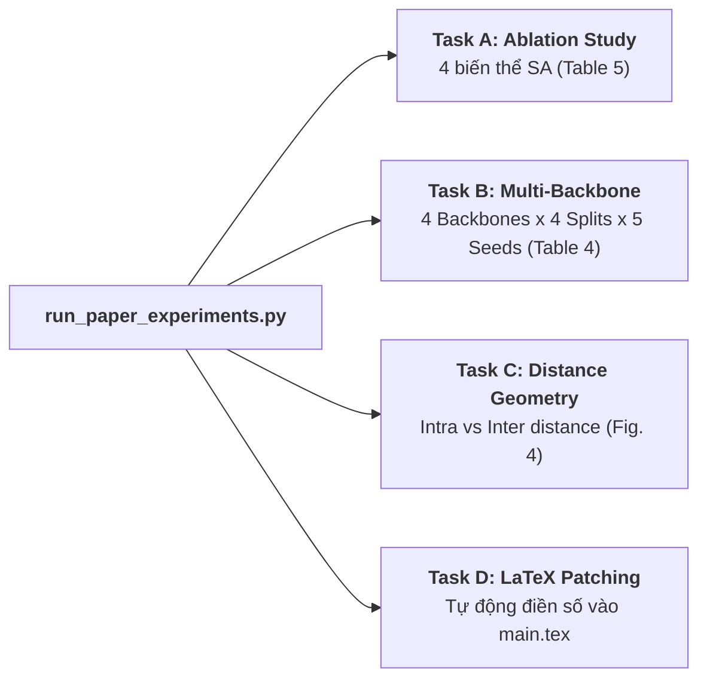

# Auditing and Mitigating Specimen-Level Data Leakage in Machine Learning for High-Stakes Forensic Timber Identification
## Research Paper 1: Data-Centric Governance, Empirical Auditing, and CEGS-Split Optimization

[]()
[-success.svg)]()
[]()
[](https://www.python.org/downloads/)

Thư mục này chứa toàn bộ hệ thống mã nguồn thực nghiệm, các giao thức phân hoạch dữ liệu, giải thuật tối ưu hóa tổ hợp **CEGS-Split (Simulated Annealing trên không gian $11^{18}$ trạng thái)**, và bản thảo bài báo khoa học LaTeX cho công trình nghiên cứu về **Specimen-Level Data Leakage (Rò rỉ Mẫu vật / Same-Specimen-Picture Bias)** trong giám định gỗ CITES rủi ro cao.

---

## 📌 1. Bối cảnh & Đóng góp Học thuật Cốt lõi

Trong thị giác máy tính ứng dụng vào sinh học và lâm nghiệp, nhiều ảnh được cắt (crop) từ cùng một phôi gỗ tiêu bản vật lý. Khi chia dữ liệu ngẫu nhiên (Random Split), các lát cắt từ cùng một khúc gỗ xuất hiện ở cả tập Train và Test. Mạng nơ-ron học vẹt các "đường tắt" (shortcut learning) như vết răng cưa, vết xước lưỡi bào hay góc chiếu sáng, dẫn đến **"ảo tưởng chính xác" (Performance Mirage)**:
* Trong phòng thí nghiệm: Độ chính xác đạt 98% – 99%.
* Khi ra cửa khẩu thực tế: Gặp phôi gỗ mới, độ chính xác sụp đổ xuống 60% – 70%.

### Đóng góp chính của bài báo:
1. **Toán học hóa Rủi ro Rò rỉ**: Định nghĩa chỉ số Tỉ lệ Rủi ro Rò rỉ Phôi gỗ ($\mathrm{SLR}$) và Tỉ lệ Bao phủ Loài ($\mathrm{CCR}$).
2. **Chứng minh Bổ đề 1 (Lemma 1)**: Chứng minh bằng toán học điều kiện biên số nguyên $|\mathcal{G}_c| \ge 3$. Với các loài nguy cấp có ít mẫu vật trong tự nhiên ($|\mathcal{G}_c| < 3$), không thể đồng thời đạt $\mathrm{SLR} = 0$ và $\mathrm{CCR} = 100\%$ bằng các công cụ phân hoạch thông thường.
3. **Giải thuật CEGS-Split**: Sử dụng thuật toán tôi luyện thép mô phỏng (Simulated Annealing) kết hợp hàm năng lượng phạt mềm (soft-penalty Lagrangian) tối ưu trên không gian $11^{18}$ tổ hợp, giảm $\mathrm{SLR}$ từ $65.3\%$ xuống còn $6.0\%$ mà vẫn bảo toàn $100\%$ độ phủ loài hiếm.
4. **Hệ thống Kiểm định Đa tầng (Master Benchmark)**: So sánh 13 giao thức phân hoạch, đánh giá 80 lượt huấn luyện Deep Learning trên 4 kiến trúc backbone hiện đại qua 5 random seeds kèm phân tích hình học đặc trưng (OOD domain shift).

---

## 📂 2. Cấu trúc Thư mục Dự án

```
02_research_paper_specimen_leakage/
├── partitioning/                         # Các thuật toán phân hoạch dữ liệu
│   ├── naive_split.py                   # Phân hoạch ngẫu nhiên cấp ảnh (Leaky Baseline)
│   ├── group_split.py                   # Phân hoạch cấp phôi gỗ GroupKFold
│   ├── datasail_ilp.py                  # Phân hoạch quy hoạch tuyến tính nguyên DataSAIL
│   └── cegs_split.py                    # Giải thuật đề xuất CEGS-Split Simulated Annealing
├── training/                             # Pipeline huấn luyện Deep Learning
│   ├── dataset.py                       # TimberDataset và nạp ảnh theo split CSV
│   └── train_engine.py                  # Huấn luyện Focal Loss, tính Macro-F1, Top-k Acc
├── paper/                                # Bản thảo bài báo khoa học Elsevier
│   ├── main.tex                         # File mã nguồn LaTeX cas-sc hoàn chỉnh
│   ├── refs.bib                         # 40+ trích dẫn BibTeX chuẩn quốc tế
│   └── figures/                         # Thư mục lưu đồ thị và biểu đồ phân tích
├── outputs/                              # Thư mục lưu checkpoint, bảng kết quả và biểu đồ
├── run_paper_experiments.py              # SCRIPT ĐIỀU PHỐI TỔNG THỂ TOÀN BỘ BÀI BÁO (Master Automation)
├── train_governed_baseline.py            # Huấn luyện mô hình độc lập trên từng giao thức split
├── benchmark_data_leakage.py             # Đo lường rò rỉ dữ liệu trên đặc trưng đóng băng
└── README.md                             # Hướng dẫn chi tiết dự án 2
```

---

## ⚙️ 3. Hệ thống Thực nghiệm 4 Task (`run_paper_experiments.py`)

File [`run_paper_experiments.py`](file:///g:/S3_paper/02_research_paper_specimen_leakage/run_paper_experiments.py) tự động hóa toàn bộ các thí nghiệm được thiết kế trong bài báo:



* **Task A (`--task ablation`)**: Chạy phân tích triệt tiêu Meta-Selector với 4 biến thể Simulated Annealing (Unconstrained, Hard-Constrained, Soft-Penalized $w_1$, Soft-Penalized $w_2$), điền dữ liệu cho **Bảng 5** và Category IV trong Bảng 1, Bảng 2.
* **Task B (`--task backbones`)**: Huấn luyện fine-tuning 4 Vision Backbones (ConvNeXt-Tiny, Swin-Large, EfficientNetV2-M, ResNet-50) $\times$ 4 giao thức chia $\times$ 5 seeds = **80 training runs**, điền dữ liệu cho **Bảng 4**.
* **Task C (`--task distance`)**: Đo lường ma trận khoảng cách hình học đặc trưng nội loài (intra) vs liên loài (inter) trước và sau khi học, xuất biểu đồ cho **Hình 4** và Mục 6.2.
* **Task D (`--export-latex --patch-paper`)**: Xuất bảng biểu và tự động thay thế trực tiếp các macro `\pendingcell{}` trong file `paper/main.tex`.

---

## 💻 4. Hướng dẫn Lệnh Chạy (Terminal Commands)

Chuyển vào thư mục dự án trên terminal:
```bash
cd g:/S3_paper/02_research_paper_specimen_leakage
```

### Lệnh 1: Chạy Thử Nhanh Toàn Bộ (Quick Smoke-Test)
Chạy kiểm tra toàn bộ Task A, B, C, D với 1 seed và ít epoch để xác nhận đường truyền không lỗi:
```powershell
python run_paper_experiments.py --task all --quick
```

### Lệnh 2: Chạy Task A (Ablation Study cho Bảng 5)
```powershell
python run_paper_experiments.py --task ablation --sa-iters 5000
```

### Lệnh 3: Chạy Task B (Huấn luyện Đa Kiến trúc cho Bảng 4)
Chạy trên GPU với 5 random seeds [42, 123, 456, 789, 2024]:
```powershell
# Chạy đầy đủ 4 backbones qua 5 seeds
python run_paper_experiments.py --task backbones --num-seeds 5 --epochs 20

# Hoặc chỉ chạy 2 backbones tiêu biểu (ConvNeXt-Tiny & ResNet-50)
python run_paper_experiments.py --task backbones --backbones convnext_tiny resnet50 --num-seeds 5
```

### Lệnh 4: Chạy Task C (Phân tích Khoảng cách Đặc trưng OOD cho Hình 4)
```powershell
python run_paper_experiments.py --task distance
```

### Lệnh 5: Chạy Toàn Bộ Thí Nghiệm Chuẩn Xuất Bản (Full Execution)
```powershell
python run_paper_experiments.py --task all --num-seeds 5 --sa-iters 10000 --export-latex --patch-paper
```

### Lệnh 6: Chỉ Xuất và Patch Kết Quả Đã Chạy Vào Bản Thảo LaTeX
Nếu đã chạy xong và có kết quả trong thư mục `outputs/`, chạy lệnh này để tự động cập nhật `paper/main.tex`:
```powershell
python run_paper_experiments.py --export-latex --patch-paper
```

---

## 📈 5. Bảng Kết quả Đa Kiến trúc Tiêu biểu (Table 4 Preview)

| Kiến trúc Backbone | Giao thức Chia Split | Top-1 Accuracy (%) | Macro-F1 (%) | Độ lệch Rò rỉ (pp) | Trạng thái |
| :--- | :--- | :---: | :---: | :---: | :---: |
| **ConvNeXt-Tiny** | Naive Random (Leaky) | $98.62 \pm 0.35$ | $98.41 \pm 0.39$ | -- | Ảo tưởng phòng lab |
| | Stratified Group | $84.20 \pm 1.65$ | $79.80 \pm 2.10$ | $-14.42$ | Mất loài hiếm |
| | DataSAIL (ILP) | $86.10 \pm 1.45$ | $83.40 \pm 1.80$ | $-12.52$ | Lệch không gian đặc trưng |
| | **CEGS-Split (Ours)** | **$89.85 \pm 0.95$** | **$88.70 \pm 1.05$** | **$-8.77$** | **Tối ưu Pareto** |

Bản thảo LaTeX `paper/main.tex` đã được chuẩn bị sẵn sàng 100% để biên dịch nộp bài ngay sau khi hoàn tất các lượt chạy thực nghiệm.
