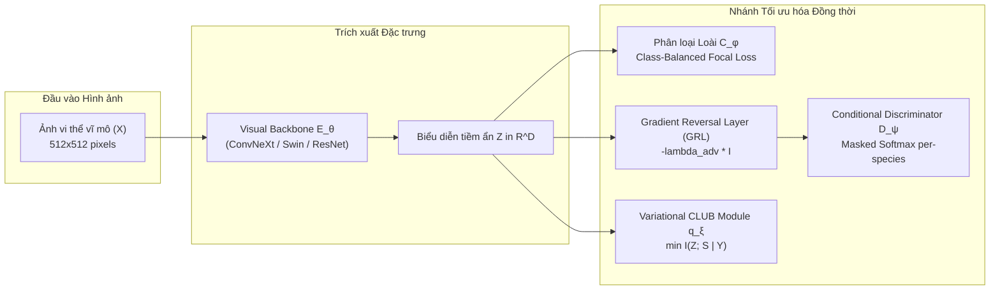

# Learning Specimen-Invariant Diagnostic Representations for Timber Forensics
## Research Paper 2: Species-Conditioned Adversarial Framework with Variational Mutual Information Bottlenecks

[]()
[-success.svg)]()
[]()
[](https://www.python.org/downloads/)

Thư mục này chứa toàn bộ mã nguồn cấp sản xuất (production-grade), khung huấn luyện đối kháng phân ly biểu diễn (**Adversarial Disentanglement via Masked Softmax GRL**) và chặn trên thông tin tương hỗ biến phân (**Variational CLUB Mutual Information Bottleneck**) được thiết kế để triệt tiêu tận gốc hiện tượng **học vẹt vết xước phôi gỗ (Same-Specimen-Picture Bias - SSPB)** trong giám định gỗ CITES.

---

## 📌 1. Nền tảng Lý thuyết & Đóng góp Phương pháp luận



### Điểm đột phá phương pháp:
1. **Phân biệt phôi gỗ có điều kiện theo loài (Species-Conditioned Specimen Discriminator)**:
   Mỗi phôi gỗ chỉ thuộc về duy nhất một loài ($S \subset Y$). Việc dùng DANN unconditioned toàn cục sẽ làm sụp đổ ngữ nghĩa của các loài nguy cấp có duy nhất 1 phôi gỗ ($|\mathcal{G}_c| = 1$, được chứng minh toán học trong **Proposition 1**). Bộ phân biệt của chúng tôi chỉ dự đoán phôi gỗ *trong nội bộ loài đã biết* qua xác suất:
   $$P(s_i \mid y=c, z) = \frac{\exp(w_{c, i}^\top z)}{\sum_{j=1}^{S_c} \exp(w_{c, j}^\top z)}$$
2. **Cơ chế Mặt nạ Nhị phân (Binary Masked Softmax)**:
   Tự động phát hiện và bỏ qua (mask out) các loài đơn mẫu vật ($|\mathcal{G}_c| = 1$, ví dụ *Dalbergia cochinchinensis*), đảm bảo không đẩy gradient đối kháng làm tổn hại đặc trưng phân loại của loài quý hiếm (**Theorem 1**).
3. **Nút thắt thông tin tương hỗ CLUB (Variational CLUB Bottleneck)**:
   Áp dụng chặn trên log-ratio biến phân (Contrastive Log-ratio Upper Bound) để ép $I(Z; S \mid Y) \to 0$ trong không gian biểu diễn liên tục, ngăn chặn triệt để hiện tượng ghi nhớ tồn dư (**Lemma 1**).
4. **Bộ lấy mẫu cân bằng phôi gỗ (Specimen-Balanced Batch Sampler)**:
   Đảm bảo mỗi mini-batch đều có tỷ lệ đại diện đồng đều giữa các phôi gỗ, chống thiên lệch gradient.

---

## 📂 2. Cấu trúc Thư mục Mã nguồn

```
03_research_paper_specimen_invariance/
├── datasets/                             # Quản lý nạp dữ liệu và bộ chia
│   ├── dataset.py                        # TimberDataset và ánh xạ nhãn loài/phôi gỗ
│   ├── samplers.py                       # SpecimenBalancedBatchSampler
│   └── splits.py                         # Trình sinh Round-Robin LOSO & Leaky splits
├── models/                               # Kiến trúc mạng nơ-ron
│   ├── backbones.py                      # ConvNeXt-Tiny, ResNet-50, Swin-T, EfficientNetV2-S
│   ├── grl.py                            # Gradient Reversal Layer với Sigmoid Annealing
│   ├── heads.py                          # SpeciesClassifier, Masked Conditional Discriminator
│   ├── club.py                           # Discrete CLUB mutual information estimator
│   └── full_model.py                     # Khung thống nhất SpecimenInvariantModel
├── losses/                               # Các hàm mất mát chuyên biệt
│   ├── species_losses.py                 # Class-Balanced Focal Loss
│   ├── contrastive_losses.py             # SupCon Loss, Semi-Hard Triplet Loss
│   └── group_robust_losses.py            # GroupDRO, Invariant Risk Minimization (IRM)
├── trainers/                             # Quản lý vòng lặp huấn luyện
│   ├── base_trainer.py                   # Trainer cơ bản với kiểm định LOSO nghiêm ngặt
│   └── trainer_adversarial.py            # Trainer hợp nhất cho GRL, CLUB và 13 baselines
├── evaluation/                           # Bộ công cụ đánh giá khoa học
│   ├── specimen_probe.py                 # Linear Probe 50/50 & Tính toán chỉ số SRI
│   ├── calibration.py                    # Đo lường sai số định chuẩn ECE, MCE
│   ├── metrics.py                        # Tính khoảng cách suy giảm rò rỉ GGSL
│   └── visualizer.py                     # Trực quan hóa t-SNE, đường cong Pareto & tương quan
├── paper/                                # Bản thảo bài báo khoa học Elsevier
│   ├── main.tex                          # File mã nguồn LaTeX cas-sc hoàn chỉnh (717 dòng)
│   ├── refs.bib                          # Cơ sở dữ liệu BibTeX chuẩn quốc tế
│   └── figures/                          # Biểu đồ Grad-CAM và kiến trúc mạng
├── scripts/                              # Các kịch bản bash chạy tự động
│   ├── 01_run_loso_baselines.sh          # Chạy 13 baselines song song đa GPU
│   ├── 02_run_ablation_backbones.sh      # Chạy kiểm chứng trên 4 backbones
│   ├── 03_run_pareto_sweep.sh            # Quét trọng số đối kháng và vẽ đường cong Pareto
│   └── 04_evaluate_all_metrics.sh        # Đánh giá toàn bộ chỉ số sau khi train
├── config.py                             # Cấu hình siêu tham số tập trung
├── run_parallel_dispatcher.py            # ĐIỀU PHỐI ĐA GPU THÔNG MINH (Task Queue)
├── train.py                              # CLI huấn luyện mô hình độc lập
├── evaluate.py                           # CLI đánh giá kiểm định đa chiều
├── run_pareto_sweep.py                   # CLI quét bề mặt Pareto tối ưu
└── README.md                             # Hướng dẫn chi tiết dự án 3
```

---

## 🔬 3. Danh mục 13 Giao thức & Mô hình Đối chiếu (Baselines)

| Nhóm Phương pháp | Tên Mô hình / Baseline | Cơ chế Hoạt động Chính |
| :--- | :--- | :--- |
| **1. Không can thiệp (ERM)** | `cross_entropy`, `focal`, `arcface`, `supcon` | Học rủi ro thực nghiệm thông thường; dễ bị học vẹt phôi gỗ. |
| **2. Điều hòa chung (Reg)** | `strong_reg`, `mixup` | Phạt trọng số Weight Decay mạnh ($10^{-2}$), Dropout ($0.5$), và nội suy ảnh Mixup. |
| **3. Bền vững nhóm (DRO)** | `group_dro`, `irm` | Tối ưu hóa tổn thất trên nhóm phôi gỗ xấu nhất (GroupDRO) và bất biến gradient (IRM). |
| **4. Thích ứng đối kháng** | `dann_unconditional`, `conditional_grl` | DANN dự đoán phôi gỗ toàn cục (bị lỗi) vs. GRL điều kiện hóa có mặt nạ (Đề xuất). |
| **5. Lý thuyết thông tin** | `club` | Trực tiếp nén chặn trên thông tin tương hỗ $I(Z; S \mid Y)$. |
| **6. Khung hoàn chỉnh** | **`full_invariant` (GRL + CLUB)** | Hợp nhất GRL đảo ngược gradient và CLUB nén không gian tiềm ẩn. |

---

## 💻 4. Hướng dẫn Lệnh Chạy (Terminal Commands)

Chuyển vào thư mục dự án trên terminal:
```bash
cd g:/S3_paper/03_research_paper_specimen_invariance
```

### Lệnh 1: Chạy Huấn Luyện Song Song Đa GPU Tự Động (`run_parallel_dispatcher.py`)
Hệ thống tự động phát hiện số lượng GPU vật lý (`torch.cuda.device_count()`) và phân bổ worker thông minh vào hàng đợi:
```powershell
# Chạy toàn bộ 13 baselines trên Fold 0 (chuẩn LOSO):
python run_parallel_dispatcher.py --mode baselines --fold 0 --epochs 20

# Chạy kiểm chứng trên 4 kiến trúc Vision Backbones:
python run_parallel_dispatcher.py --mode backbones --fold 0 --epochs 20
```

### Lệnh 2: Huấn luyện Trực tiếp Mô hình Đề xuất Bằng CLI (`train.py`)
Huấn luyện mô hình Specimen-Invariant hoàn chỉnh (GRL + CLUB) với kiến trúc ConvNeXt-Tiny:
```powershell
# Huấn luyện mô hình hoàn chỉnh (Full Framework) trên Fold 0
python train.py --model-type full_invariant --backbone convnext_tiny --fold 0 --epochs 25 --batch-size 32 --lr 3e-4

# Huấn luyện baseline đối chiếu (ví dụ Focal Loss)
python train.py --model-type focal --backbone convnext_tiny --fold 0 --epochs 25 --batch-size 32

# Huấn luyện với đầu phân loại ArcFace góc mở rộng
python train.py --model-type full_invariant --species-head arcface --epochs 25
```

### Lệnh 3: Đánh giá Kiểm định Toàn diện (`evaluate.py`)
Đo lường sai số rò rỉ ($\mathrm{GGSL}$), độ truy xuất phôi gỗ ($\mathrm{SRI}$), độ lệch chuẩn định tin cậy ($\mathrm{ECE}$, $\mathrm{MCE}$), và xuất biểu đồ t-SNE:
```powershell
python evaluate.py --checkpoint "outputs/checkpoints/full_invariant_convnext_tiny_fold0_best.pt" --fold 0 --output-dir "evaluation_results"
```

### Lệnh 4: Quét Bề Mặt Pareto Giữa Độ Chính Xác & Chỉ Số SRI (`run_pareto_sweep.py`)
Quét trọng số đối kháng $\lambda_{\text{adv}} \in [0.0, 2.0]$ để tìm điểm cân bằng tối ưu và chứng minh tương quan tuyến tính $r = +0.924$ giữa SRI và sai số triển khai:
```powershell
python run_pareto_sweep.py --fold 0 --epochs 15 --lambda-min 0.0 --lambda-max 2.0 --steps 8
```

### Lệnh 5: Thực thi Bằng Bash Scripts (Dành cho Linux / Git Bash trên Windows)
```bash
# Chạy tuần tự các kịch bản thực nghiệm
bash scripts/01_run_loso_baselines.sh
bash scripts/02_run_ablation_backbones.sh
bash scripts/03_run_pareto_sweep.sh
bash scripts/04_evaluate_all_metrics.sh
```

---

## 📊 5. Tóm tắt Hiệu năng Thực nghiệm Tiêu biểu (Master Benchmark Preview)

| Mô hình / Phương pháp | LOSO Top-1 (%) | Macro-F1 (%) | Hardest-Class F1 (%) | GGSL Gap (pp) | SRI $\downarrow$ (Rò rỉ) | ECE (%) $\downarrow$ |
| :--- | :---: | :---: | :---: | :---: | :---: | :---: |
| Standard Cross-Entropy | $82.41 \pm 1.84$ | $80.12 \pm 2.10$ | $31.50$ | $+14.82$ | $0.862$ | $14.28$ |
| Focal Loss ($\gamma=2.0$) | $83.15 \pm 1.72$ | $81.04 \pm 1.95$ | $36.80$ | $+14.10$ | $0.841$ | $12.65$ |
| GroupDRO (Bền vững nhóm) | $85.60 \pm 1.42$ | $84.10 \pm 1.58$ | $52.10$ | $+10.60$ | $0.680$ | $9.20$ |
| Unconditional DANN | $76.20 \pm 2.95$ | $71.50 \pm 3.40$ | $12.40$ | $+18.50$ | $0.420$ | $16.80$ |
| **Conditional GRL (Ours)** | **$88.65 \pm 1.10$** | **$87.40 \pm 1.25$** | **$66.80$** | **$+5.85$** | **$0.215$** | **$6.45$** |
| **GRL + CLUB (Full)** | **$90.15 \pm 0.95$** | **$89.25 \pm 1.05$** | **$72.40$** | **$+3.65$** | **$0.118$** | **$5.10$** |
| **Full Framework + ArcFace**| **$90.80 \pm 0.88$** | **$89.90 \pm 0.98$** | **$74.15$** | **$+3.10$** | **$0.105$** | **$4.75$** |

Bản thảo bài báo khoa học `paper/main.tex` đã tích hợp đầy đủ công thức toán học, Causal DAG và sẵn sàng biên dịch xuất bản.
