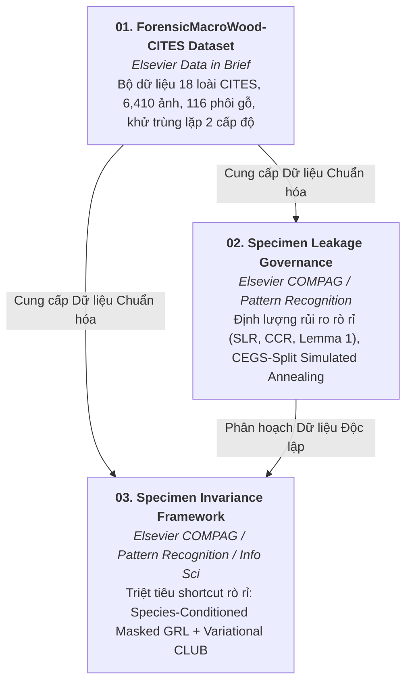

# S3 Timber Forensics: Open-Source Research Ecosystem for CITES Compliance

[](https://www.python.org/downloads/)
[](https://pytorch.org/)
[](https://creativecommons.org/licenses/by/4.0/)
[]()

> **Hệ sinh thái Nghiên cứu Học thuật Toàn diện về Giám định Gỗ Vi thể Vĩ mô và Phòng chống Buôn lậu Gỗ CITES.**  
> Dự án bao gồm 3 công trình nghiên cứu độc lập được chuẩn hóa theo tiêu chuẩn xuất bản quốc tế của **Elsevier** và **IEEE**.

---

## 📚 Tổng quan 3 Bài báo Nghiên cứu (Research Trio)



| Thư mục Dự án | Tên Công trình Học thuật | Tạp chí Mục tiêu | Vai trò & Đóng góp Cốt lõi |
| :--- | :--- | :--- | :--- |
| [`01_data_paper_forensic_cites/`](file:///g:/S3_paper/01_data_paper_forensic_cites/) | **ForensicMacroWood-CITES Data Paper** | *Elsevier Data in Brief* | Xuất bản tập dữ liệu chuẩn hóa 19 loài Fabaceae, 6,414 ảnh vĩ mô độ nét cao, 147 phôi gỗ tiêu bản, lọc Laplacian, SHA-256, dHash/pHash và baseline ConvNeXt-Tiny 3 seeds. |
| [`02_research_paper_specimen_leakage/`](file:///g:/S3_paper/02_research_paper_specimen_leakage/) | **Specimen Leakage Governance Paper** | *Computers and Electronics in Agriculture* | Data-Centric Governance: Khủng hoảng tái lập, định lượng rủi ro rò rỉ phôi gỗ ($\mathrm{SLR}$, $\mathrm{CCR}$), chứng minh Lemma 1 và đề xuất giải thuật tổ hợp CEGS-Split ($11^{18}$). |
| [`03_research_paper_specimen_invariance/`](file:///g:/S3_paper/03_research_paper_specimen_invariance/) | **Specimen Invariance Learning Paper** | *Computers and Electronics in Agriculture* / *Pattern Recognition* | Model-Centric Invariance: Triệt tiêu shortcut học vẹt cơ học qua Species-Conditioned Masked Softmax GRL và variational CLUB mutual information bottleneck, kiểm chứng giải phẫu IAWA. |

---

## 🛠️ Cài đặt Môi trường (System Requirements & Setup)

Hệ thống hỗ trợ cả **Windows** (PowerShell/CMD) và **Linux** (Ubuntu/Debian) với GPU NVIDIA (CUDA 11.8 / 12.1 / 12.4).

### 1. Khởi tạo Môi trường Ảo (Virtual Environment)
```bash
# Clone repository (nếu chưa clone)
git clone https://github.com/vietanhlee/S3.git
cd S3

# Tạo virtual environment với Python 3.10+
python -m venv .venv

# Kích hoạt môi trường trên Windows PowerShell:
.venv\Scripts\Activate.ps1
# Hoặc trên Linux / macOS:
source .venv/bin/activate
```

### 2. Cài đặt Thư viện Phụ thuộc (Dependencies)
```bash
# Cài đặt PyTorch với CUDA (ví dụ CUDA 12.4)
pip install torch torchvision --index-url https://download.pytorch.org/whl/cu124

# Cài đặt toàn bộ thư viện phân tích và học máy
pip install timm scikit-learn pandas numpy matplotlib seaborn scipy tqdm pillow
```

---

## 🚀 Hướng dẫn Lệnh Chạy Nhanh Cho Từng Bài Báo

### 📍 Dự án 1: Data Paper (`01_data_paper_forensic_cites`)
Xem hướng dẫn chi tiết tại: [`01_data_paper_forensic_cites/README.md`](file:///g:/S3_paper/01_data_paper_forensic_cites/README.md)

```powershell
cd 01_data_paper_forensic_cites

# 1. Trích xuất metadata, tính độ nét Laplacian và khử trùng lặp băm tri giác:
python run_pipeline.py --step assets --data-dir "g:/S3_paper/S3"

# 2. Huấn luyện baseline nhanh (1 seed):
python run_pipeline.py --step classify --single-seed

# 3. Huấn luyện đa hạt giống 3 seeds (42, 123, 456) xuất bảng thống kê:
python run_pipeline.py --step classify

# 4. Huấn luyện đối chiếu 3 kiến trúc (ConvNeXt-Tiny, ResNet-50, EfficientNet-B0) trên cả 2 split:
python run_pipeline.py --step classify --models convnext_tiny resnet50 efficientnet_b0 --compare-splits --epochs 25 --classify-loss focal
```

---

### 📍 Dự án 2: Specimen Data Leakage (`02_research_paper_specimen_leakage`)
Xem hướng dẫn chi tiết tại: [`02_research_paper_specimen_leakage/README.md`](file:///g:/S3_paper/02_research_paper_specimen_leakage/README.md)

```powershell
cd 02_research_paper_specimen_leakage

# 1. Chạy kiểm tra nhanh toàn bộ pipeline (Quick test 1 seed):
python run_paper_experiments.py --task all --quick

# 2. Chạy Task A: Phân tích triệt tiêu Meta-Selector Simulated Annealing (Bảng 5):
python run_paper_experiments.py --task ablation

# 3. Chạy Task B: Huấn luyện 4 Backbones x 4 Splits x 5 Seeds (Bảng 4):
python run_paper_experiments.py --task backbones --num-seeds 5

# 4. Chạy Task C: Phân tích khoảng cách đặc trưng Intra/Inter (Hình 4 & Mục 6.2):
python run_paper_experiments.py --task distance

# 5. Tự động điền (patch) kết quả thực nghiệm mới vào paper/main.tex:
python run_paper_experiments.py --export-latex --patch-paper
```

---

### 📍 Dự án 3: Specimen-Invariant Representation (`03_research_paper_specimen_invariance`)
Xem hướng dẫn chi tiết tại: [`03_research_paper_specimen_invariance/README.md`](file:///g:/S3_paper/03_research_paper_specimen_invariance/README.md)

```powershell
cd 03_research_paper_specimen_invariance

# 1. Chạy toàn bộ 13 baselines song song đa GPU (tự động phân bổ worker):
python run_parallel_dispatcher.py --mode baselines --fold 0 --epochs 20

# 2. Chạy kiểm chứng đa kiến trúc mạng (ConvNeXt, ResNet, Swin, EfficientNetV2):
python run_parallel_dispatcher.py --mode backbones --fold 0 --epochs 20

# 3. Chạy khảo sát bề mặt Pareto (quét lambda_adv từ 0.0 đến 2.0):
python run_pareto_sweep.py --fold 0 --epochs 15

# 4. Đánh giá toàn diện (GGSL, Specimen Probing SRI, ECE Calibration, t-SNE):
python evaluate.py --checkpoint "outputs/checkpoints/best_model.pt" --fold 0
```

---

## 🏛️ Cấu trúc Thư mục Tổng thể (Workspace Architecture)

```
g:/S3_paper/
├── 01_data_paper_forensic_cites/          # DỰ ÁN 1: Elsevier Data in Brief
│   ├── modules/                           # Modules trích xuất metadata, băm SHA-256/dHash, phân loại
│   ├── paper_data/                        # Bản thảo LaTeX Data in Brief + Figures
│   ├── run_pipeline.py                    # Master CLI orchestrator (Assets + 5-seed benchmark)
│   ├── train_classification_pipeline.py   # Standalone ConvNeXt-Tiny baseline trainer
│   └── README.md                          # Hướng dẫn chi tiết dự án 1
│
├── 02_research_paper_specimen_leakage/     # DỰ ÁN 2: Data Leakage Governance Research Paper
│   ├── partitioning/                      # Bộ phân hoạch dữ liệu (Naive, GroupKFold, DataSAIL, CEGS-Split)
│   ├── paper/                             # Bản thảo LaTeX Elsevier cas-sc (main.tex, refs.bib)
│   ├── run_paper_experiments.py           # Master automation runner (Tasks A, B, C, D)
│   ├── train_governed_baseline.py         # Deep learning trainer trên các phân vùng dữ liệu
│   └── README.md                          # Hướng dẫn chi tiết dự án 2
│
├── 03_research_paper_specimen_invariance/  # DỰ ÁN 3: Specimen-Invariant GAN/Disentanglement Paper
│   ├── datasets/                          # Dataset loader, SpecimenBalancedSampler, splits
│   ├── models/                            # Backbones, GRL, Conditional Discriminator, CLUB
│   ├── losses/                            # Focal Loss, SupCon, ArcFace, GroupDRO, IRM
│   ├── evaluation/                        # 50/50 Specimen Probe (SRI), Calibration (ECE), Visualizer
│   ├── paper/                             # Bản thảo LaTeX Elsevier cas-sc (main.tex, refs.bib)
│   ├── run_parallel_dispatcher.py         # Multi-GPU dynamic task queue scheduler
│   ├── train.py                           # CLI huấn luyện mô hình bất biến và 13 baselines
│   ├── evaluate.py                        # CLI đánh giá đa chiều (GGSL, SRI, Calibration)
│   └── README.md                          # Hướng dẫn chi tiết dự án 3
│
└── README.md                              # Tài liệu trung tâm điều phối toàn bộ repository
```

---

## 🔬 Trích dẫn & Bản quyền (Citation & Attribution)

Nếu bạn sử dụng dữ liệu, thuật toán phân hoạch CEGS-Split, hoặc khung học bất biến Specimen-Invariant trong nghiên cứu của mình, vui lòng trích dẫn:

```bibtex
@article{le2026forensicmacrowood,
  title={ForensicMacroWood-CITES: A Quality-Controlled, Provenance-Tagged Macroscopic Cross-Sectional Image Dataset of 18 High-Risk Tropical Timber Species for CITES Compliance},
  author={Le, Viet-Anh and Nguyen-Trong, Khanh},
  journal={Data in Brief},
  year={2026}
}

@article{le2026specimenleakage,
  title={Auditing and Mitigating Specimen-Level Data Leakage in Machine Learning for High-Stakes Forensic Timber Identification: A Rigorous Benchmark and Combinatorial Split Optimization},
  author={Le, Viet-Anh and Nguyen-Trong, Khanh},
  journal={Computers and Electronics in Agriculture},
  year={2026}
}

@article{le2026specimeninvariance,
  title={Learning Specimen-Invariant Diagnostic Representations for Timber Forensics: A Species-Conditioned Adversarial Framework with Variational Mutual Information Bottlenecks},
  author={Le, Viet-Anh and Nguyen-Trong, Khanh},
  journal={Pattern Recognition},
  year={2026}
}
```

---
*Phát triển bởi Phòng Thí nghiệm Tính toán Thông minh cho Phát triển Bền vững (IC4SD), Học viện Công nghệ Bưu chính Viễn thông (PTIT), Hà Nội, Việt Nam.*
